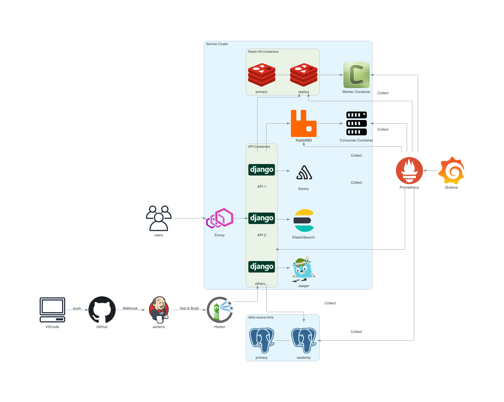

## e-commerce

현재 진행 중인 프로젝트로 헤드리스 커머스 백엔드 서버 구현을 목표로 합니다.

REST API 헤드리스 서버로서, 클라이언트는 별도로 구현되어야 합니다.

## 사용기술 및 환경

- Django, DRF, PostgreSQL, Redis, RabbitMQ, Envoy, ElasticSearch, Sentry, Jenkins, Harbor, Prometheus, Grafana, nGrinder, Docker, AWS

## 전체적인 프로젝트의 구조

## 프로젝트의 중요 관심사

- 가독성을 위한 클린코드
- PEP8 준수
- 성능 극대화를 위한 쿼리 최적화
- 서버 부하 분산을 위한 캐싱
- 테스트 커버리지 극대화
- 비동기 작업 처리를 위한 Celery

### 브랜치 관리 전략

단독 프로젝트로서 리뷰어가 없지만, CI/CD를 위해 최소한의 브랜치 관리 전략인 GitHub Flow를 사용합니다.

- `main`: 배포 가능한 상태의 브랜치
- `develop`: 개발 중인 브랜치

### 클린코드

코드의 레거시화를 방지하고 가독성을 높이기 위해 다음을 클린코드를 지향합니다.

- PEP8 준수
- 함수, 클래스, 변수명은 의미가 명확하게
- 함수는 한 가지 일만 수행하도록
- 함수는 최대 20줄 이내로

### 테스트

- Django, DRF에서 제공하는 테스트 기능을 사용하여 테스트를 작성합니다.
- 테스트 커버리지는 100%를 목표로 합니다.
- Jenkins를 사용하여 테스트를 자동화합니다.

### 성능 테스트

nGrinder를 사용하여 성능 테스트를 수행합니다.

## CI/CD

- Jenkins 로컬 서버를 사용하여 CI/CD를 자동화합니다.
- PR을 통해 `main` 브랜치로 병합되면, 자동으로 테스트를 수행하고 빌드합니다.
- 빌드된 Docker 이미지는 Harbor에 푸시됩니다.
